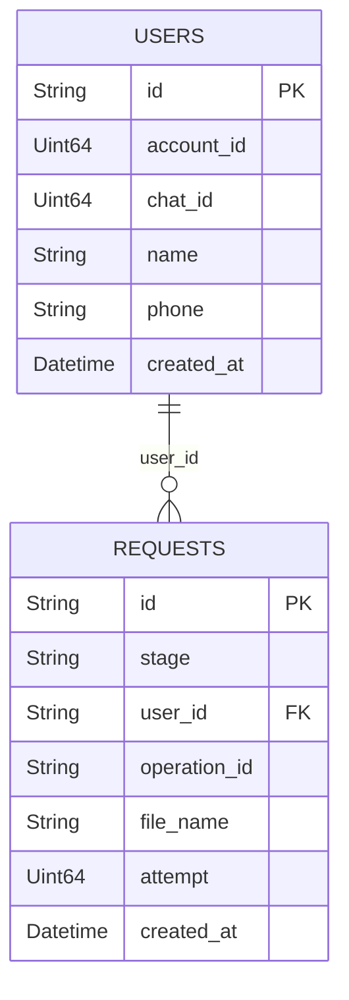

# serverless-telegram-bot

Telegram bot for call analysis.

## About

Example of a Telegram bot implementation running on Yandex Cloud Function, connected to YDB database, using the [python-telegram-bot](https://github.com/python-telegram-bot/python-telegram-bot) package for Python 3.

## Deployment

[Complete guide](https://cloud.yandex.ru/ru/docs/storage/tools/boto#locally_2  )

1. Install https://aws.amazon.com/ru/cli/
   Navigate to the ~/.aws/ directory (for macOS and Linux) or C:\Users<username>.aws\ (for Windows).
   Move the .aws folder.

2. Verify the setup from the console:  
   C:\Users\iamorev>aws s3 ls s3://telegram-files

3. Run the bot with the `bot.local_handler` function.

### If deploying to Yandex Function for production

1. Create a function and set the entry point to `bot.cloud_handler`.

2. Set the environment variables: <br>
   `TOKEN,
   S3_BUCKET,
   YDB_DATABASE,
   YDB_ENDPOINT,
   AWS_ACCESS,
   AWS_SECRET_ACCESS_KEY,
   AWS_DEFAULT_REGION.`

3. Create an API Gateway in Yandex Cloud with the following specification:

```yaml
openapi: 3.0.0
info:
  title: <FUNCTION_NAME>
  version: 1.0.0
paths:
  /<FUNCTION_NAME>:
    post:
      x-yc-apigateway-integration:
        payload_format_version: '0.1'
        function_id: <FUNCTION_ID>
        tag: $latest
        type: cloud_functions
        service_account_id: <SERVICE_ACCOUNT_ID>
      operationId: <FUNCTION_NAME>
```

where:<br>
`<FUNCTION_NAME>` - name of the function;<br>
`<FUNCTION_ID>` - ID of the function;<br>
`<SERVICE_ACCOUNT_ID>` - ID of the service account connected to the function.<br>
After creating the gateway, the servers.url field will appear in the specification.

4. Create a webhook via the command
   line ([see examples](https://cloud.yandex.ru/ru/docs/tutorials/serverless/telegram-bot-serverless)):<br>
   Example for Linux:

```commandline
curl \
  --request POST \
  --url https://api.telegram.org/bot<TOKEN>/setWebhook \
  --header 'content-type: application/json' \
  --data '{"url": "<API_GATEWAY>/<FUNCTION_NAME>"}'
```

where:<br>
`<TOKEN>` - Telegram bot token;<br>
`<API_GATEWAY>` - servers.url from the API Gateway specification;<br>
`<FUNCTION_NAME>` - name of the function.

5. Check the webhook status at:
   `https://api.telegram.org/bot<TOKEN>/getWebhookInfo`

6. To remove the webhook if needed:

```commandline
curl \
  --request POST \
  --url https://api.telegram.org/bot<TOKEN>/setWebhook?remove
```

## Entities



